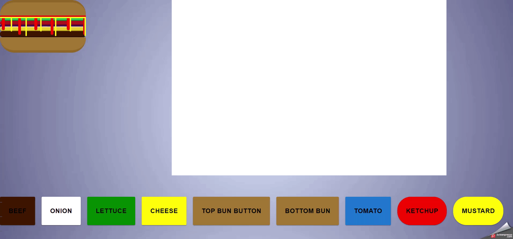

 <h2 >
  Burger game (under construction) 
 </h2>
 
 <h4>
 Burger game which generates random burger (with diffrent ingredients) and chef (user) has to make the exactly the same one as model burger as quick as she/he can!
 After every match of burger in play area with model burger user gets the score depending on how quickly she/he would do it.
 On higher levels chef gets more complicated burgers or even some drinks, and sets with fries.
 Diffrent levels are some kind of becoming the best burger chef in the world from shitty intern.
      
 </h4>

    
 

